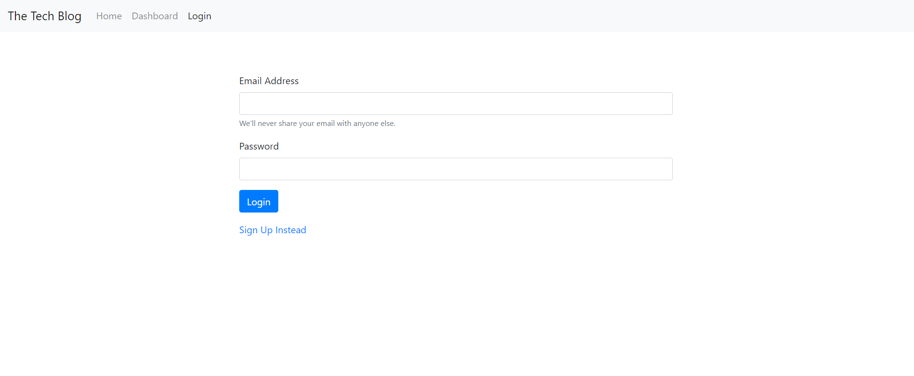
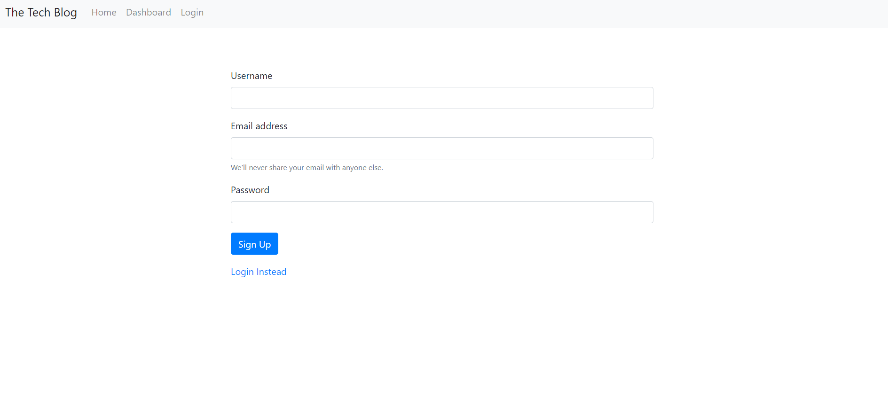
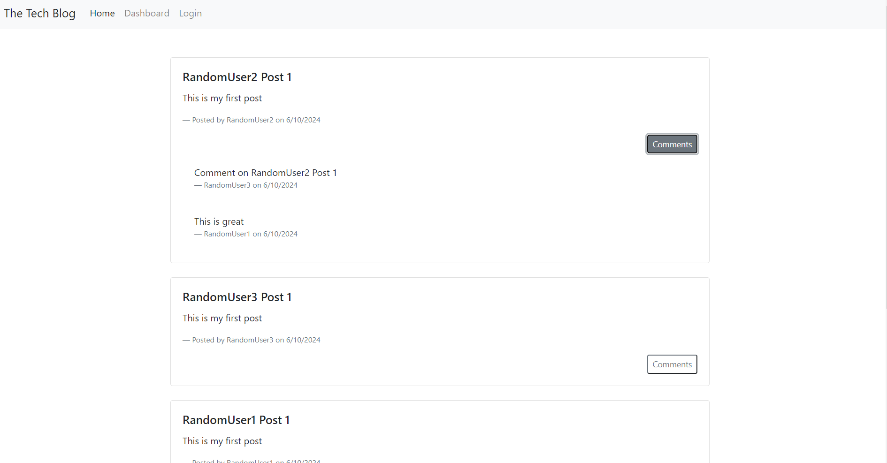
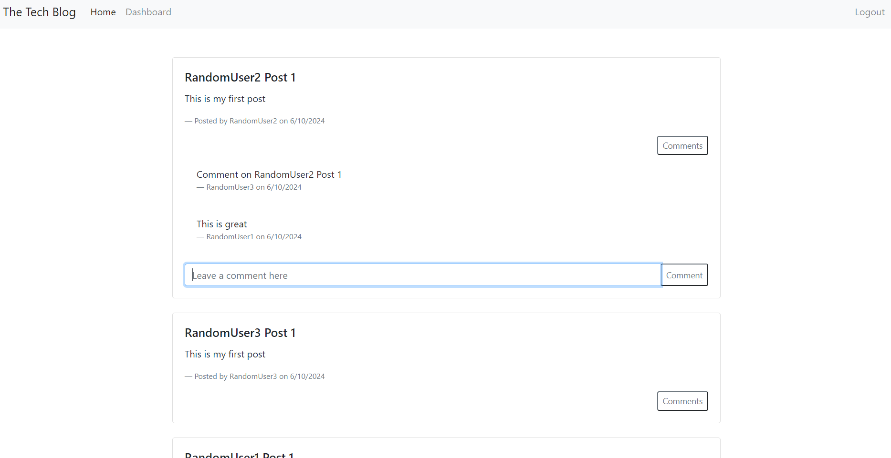
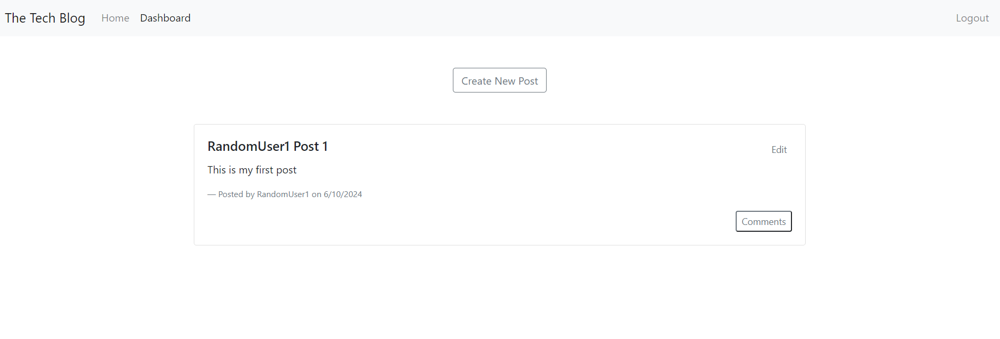
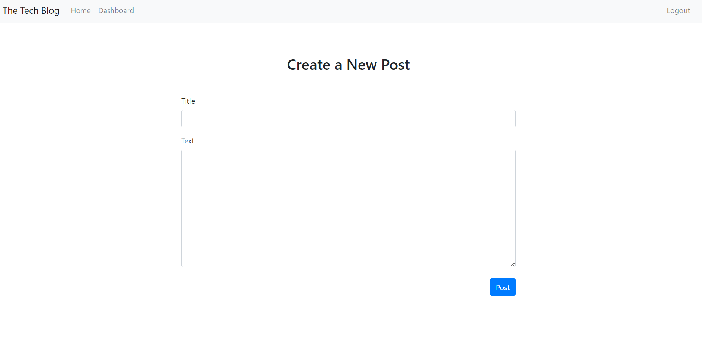
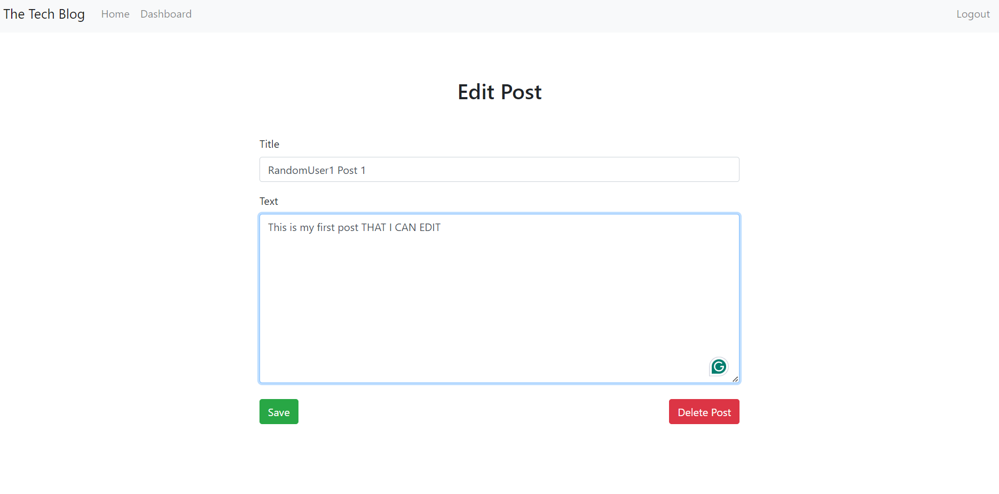

# MVC Tech Blog

## Description

For this assignment, I was tasked with building a full stack blog site, where users can upload their own posts and comment on each other's posts.

## Installation

For this assignment, I was given no starter code which meant I had to start from scratch so my first ste was installing all the packages and technologies I needed. My next stepw as to create my models and their relationships to each other. To complete this, I made a model for users which contained a username, email , and password, posts which contained a title and text, and comments which just contained text. I then linked my posts and comments models to the user model with a foreign key and linked the comments model to the posts model using a foreign key.

From there, it was time to create my routes. I started with the user routes which handled a user registering, logging in, and logging out. I then created my home routes which handled navigation of the site and made sure each route rendered the correct page with the correct data each page needed. I then created the routes for creating, updating, and deleting posts as well as the routes for creating a comment.

After that, it was time to create the view using handlebars pages. I started with the main layout which contained the navbar that would be displayed on every page. I then created logic for the navbar which would initiate the routes for each button that was clicked. I made sure to include conditionals that redirected the user if they weren't logged in an displayed the logout button if they were. I then created the login and signup pages that took in user input and passed it to the necessary routes to be run. After that, I created the hompepage and using a for each conditional, displayed every blog post with conditionals that hid the ability to comment if a user was not logged in. From there, I created the dashboard which displayed only that specific user's posts and displayed buttons for creating and editing posts. I made sure to add logic to each of these buttons to redirect the user to different pages for creating and editing posts. On the create new post page, I displayed an empty form for the user to fill in for thier new post and added logic to the post button that sent that inputted data to the correct route for creating a new post. I did something similar for the edit post page, but gave default input from that specific post so the user could edit the pre-existing content for that post. I then added a button to save the updates that passed the inputted values to the correct route for updating a post. I also added a delete button that deleted that specific post.

After all of that was complete, I just needed to add a helper that formatted the dates on the pages and an auth.js to redirect the user to the login page if they weren't logged in.

## Usage

To visit my site click

Once you are there, you will see a login page as well as a navbar to visit the homepage or dashboard. You will also see an option to sign up instead.

When that is clicked, you will be redirected to the sign up page where you can create an account with a username, email, and password.

Once signed up, you will be redirected back to the login page where you can either login or use the navbar to navigate to the homepage or dashboard. If dashboard is clicked, you will be redirected to the login page because you need to be logged in to view that. If home is clicked before logging in, you will see a homepage with all of the existing blog posts with a title, content, who they were created by and when. You will also be able to view the comments under each post.

Once logged in, you will be able to view the homepage again, this time with the ability to add a comment to a post. You will also see the logout button replace the login button in the navbar and have the ability to naviaget to the dashboard

Once that is clicked, you will see your dashboard with all of your existing posts and a button to create a new post as well as an edit button on each post.

When you click on Create New Post, you will b etaken to a form where you can enter a title and text for a new post and a button to post it.

When that button is clicked, you will be redirected back to your dashboard with the newly created post. When the edit button on a post is clicked, you will be taken to a similar form that contains the pre-existing content for that post with the ability to edit and save or the option to delete the post entirely. If either of those buttons is clicked, you will be redirected to the dashboard with the changes you made.

Lastly, if either logout is clicked or you are idle on the site for more than 30 minutes, you will be logged out and redirected back to the login page.
